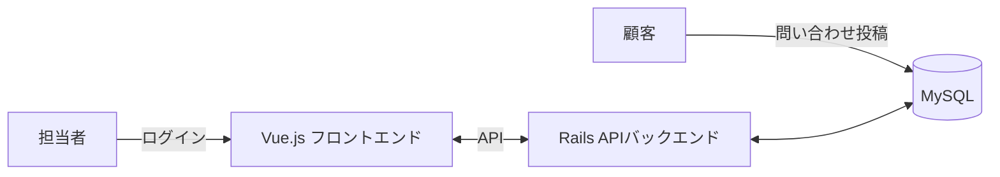

# InquiryManagement（問い合わせ管理アプリ）

顧客からの問い合わせを担当者が管理・返信するWebアプリケーション。[TaskManagement](https://github.com/takahiromorikawa/TaskManagement)とは異なる技術スタック（Ruby on Rails + Vue.js + MySQL）で、1対多のリレーション（問い合わせと返信）と認証機能（担当者ログイン）を伴う設計・実装を行っている。

## 動作確認

<!-- TODO: 実際の動作確認動画・画面キャプチャをここに貼り付ける -->

準備中。実装完了後、一連の操作（問い合わせ投稿 → 担当者ログイン → 一覧・詳細確認 → 返信・ステータス変更）を確認できる動画をここに追加する予定。

より詳しい画面構成・画面遷移は[画面仕様](docs/screens.md)を参照。

## ドキュメント

| ドキュメント | 内容 |
|---|---|
| [画面仕様](docs/screens.md) | 画面一覧・画面遷移・ワイヤーフレーム（ドキュメントの起点） |
| [要件定義書](docs/requirements.md) | 背景・目的、非機能要件 |
| [機能要件](docs/features.md) | 機能一覧、ユースケース |
| [データベース設計](docs/database.md) | データ項目、ER図 |
| [API仕様](docs/api.md) | エンドポイント一覧、シーケンス図 |
| [技術スタック](docs/tech-stack.md) | 使用技術、ディレクトリ構成の方針 |

## 技術スタック（概要）

| 分類 | 技術 |
|---|---|
| バックエンド | Ruby on Rails（APIモード） |
| フロントエンド | Vue.js（TypeScript） / Vite |
| データベース | MySQL |

詳細は[技術スタック](docs/tech-stack.md)を参照。

## セットアップ

環境構築手順は、実装の進行に合わせて本セクションに追記する。

## 開発フロー

Issue作成 → ブランチ作成 → Pull Request → マージ、という開発フローに従う。詳細は[CLAUDE.md](CLAUDE.md)を参照。
