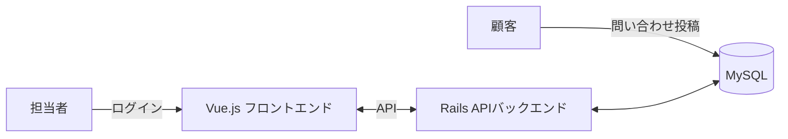
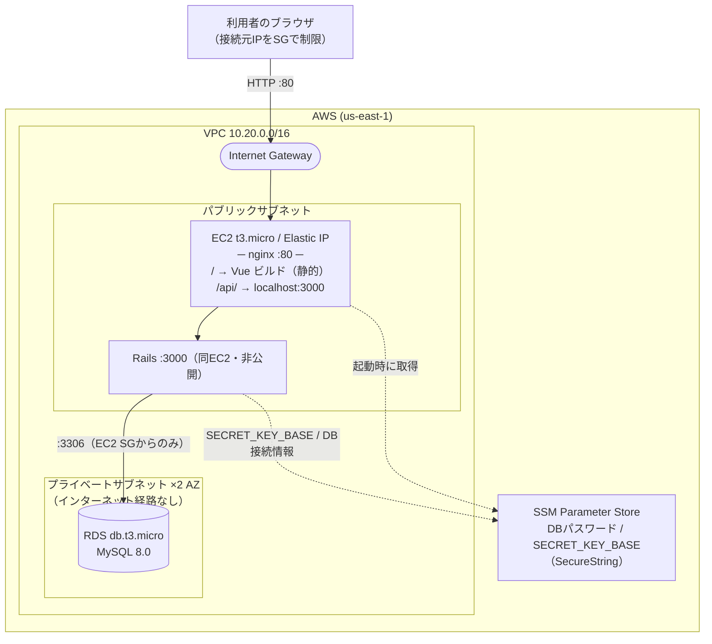

# InquiryManagement（問い合わせ管理アプリ）

顧客からの問い合わせを担当者が管理・返信するWebアプリケーション。[TaskManagement](https://github.com/takahiromorikawa/TaskManagement)とは異なる技術スタック（Ruby on Rails + Vue.js + MySQL）で、1対多のリレーション（問い合わせと返信）と認証機能（担当者ログイン）を伴う設計・実装を行った。

## 動作確認

バックエンド（Rails API）・フロントエンド（Vue）とも MVP の機能一式を実装済み。AWS（EC2 + RDS）にもデプロイ済み
（URL は `cd infra && terraform output -raw app_url`。接続元 IP をセキュリティグループで制限）。
ローカルでの起動手順は下記「セットアップ」、デプロイは [`infra/README.md`](infra/README.md) を参照。

以下は AWS 上のデプロイ環境で一連の操作を録画したもの（[`docs/videos/`](docs/videos)）。
ログインは seed の管理者アカウント `yamada@example.com` / `password`。

**① 問い合わせを投稿する（顧客・ログイン不要 / UC1）**

<video src="https://github.com/takahiromorikawa/InquiryManagement/raw/main/docs/videos/01-inquiry-create.mp4" controls muted></video>

**② 担当者ログイン → 問い合わせ一覧（UC2 / UC3）**

<video src="https://github.com/takahiromorikawa/InquiryManagement/raw/main/docs/videos/02-login-and-inquiry-list.mp4" controls muted></video>

**③ 問い合わせ詳細・返信スレッドの確認（UC4）**

<video src="https://github.com/takahiromorikawa/InquiryManagement/raw/main/docs/videos/03-inquiry-detail.mp4" controls muted></video>

**④ 返信を投稿する（UC5）**

<video src="https://github.com/takahiromorikawa/InquiryManagement/raw/main/docs/videos/04-inquiry-reply.mp4" controls muted></video>

**⑤ ステータスを変更する（UC6）**

<video src="https://github.com/takahiromorikawa/InquiryManagement/raw/main/docs/videos/05-status-change.mp4" controls muted></video>

**⑥ 担当者一覧（管理者のみ / UC8）**

<video src="https://github.com/takahiromorikawa/InquiryManagement/raw/main/docs/videos/06-staff-list.mp4" controls muted></video>

**⑦ 担当者を追加する（管理者のみ / UC8）**

<video src="https://github.com/takahiromorikawa/InquiryManagement/raw/main/docs/videos/07-staff-create.mp4" controls muted></video>

**⑧ ログアウト（UC7）**

<video src="https://github.com/takahiromorikawa/InquiryManagement/raw/main/docs/videos/08-logout.mp4" controls muted></video>

> 動画が再生されない場合は [`docs/videos/`](docs/videos) 内の mp4 を直接開いてください。

**担当者ログイン（seed の管理者アカウント）**

| メールアドレス | パスワード | 権限 |
|---|---|---|
| `yamada@example.com` | `password` | 管理者（担当者の追加ができる） |

他の担当者はログイン後、山田太郎（管理者）が「担当者管理」画面から追加する。

完成イメージの静的モック（HTML/CSS/JS のみ）を [`mock/index.html`](mock/index.html) に置いている
（`cd mock && python3 -m http.server 8080`）。



より詳しい画面構成・画面遷移は[画面仕様](docs/screens.md)を参照。

## ドキュメント

| ドキュメント | 内容 |
|---|---|
| [画面仕様](docs/screens.md) | 画面一覧・画面遷移・ワイヤーフレーム（ドキュメントの起点） |
| [要件定義書](docs/requirements.md) | 背景・目的、非機能要件 |
| [機能要件](docs/features.md) | 機能一覧、ユースケース |
| [データベース設計](docs/database.md) | データ項目、ER図 |
| [API仕様](docs/api.md) | エンドポイント一覧、シーケンス図 |
| [技術スタック](docs/tech-stack.md) | 使用技術、ディレクトリ構成の方針 |

## 技術スタック（概要）

| 分類 | 技術 |
|---|---|
| バックエンド | Ruby 3.3.9 / Ruby on Rails 7.1（APIモード） |
| フロントエンド | Vue.js（JavaScript） / Vite / Vue Router / Pinia |
| データベース | MySQL 8.0（Docker Compose で起動） |

詳細は[技術スタック](docs/tech-stack.md)を参照。

## ディレクトリ構成

```
InquiryManagement/
├── backend/            Rails APIバックエンド
├── frontend/           Vue フロントエンド
├── infra/              AWS 構成（Terraform: EC2 + RDS 最小構成）
├── docker-compose.yml  ローカル開発用の MySQL 8.0
└── docs/               設計ドキュメント
```

## インフラ構成（AWS）

`infra/`（Terraform）で構築。EC2 1台に nginx + Rails をコンテナで載せ、DB は RDS。
RDS は EC2 のセキュリティグループからのみ到達でき、インターネットからは触れない。
詳細・手順は [`infra/README.md`](infra/README.md)。



- EC2: Docker Compose（`docker-compose.prod.yml`）で `frontend`(nginx) と `backend`(Rails) を起動。公開ポートは 80 のみ
- RDS: `publicly_accessible = false`、Single-AZ、セキュリティグループのインバウンドは **EC2 SG からの 3306 のみ**（CIDR 許可なし）
- NAT Gateway・Multi-AZ なし。SSH キーは作らず SSM Session Manager でアクセス
- 認証情報は Terraform が生成し SSM Parameter Store（SecureString）へ。リポジトリには含めない

## セットアップ

### 前提

- Ruby 3.3.9（`backend/.ruby-version` で固定。rbenv 等で導入）
- Docker（MySQL の起動に使用）

### 1. データベースの起動

リポジトリ直下で:

```bash
docker compose up -d
```

MySQL 8.0 が `localhost:3306` で起動する（DB名: `inquiry_management_development` / ユーザー: `root` / パスワード: `password`）。接続情報は [backend/config/database.yml](backend/config/database.yml) を参照。環境変数（`DB_HOST` / `DB_PORT` / `DB_USERNAME` / `DB_PASSWORD` / `DB_NAME`）で上書きできる。

> ローカルに Homebrew などの MySQL が `3306` で起動していると競合する。その場合は停止（例: `brew services stop mysql@8.0`）してから、上記のデフォルトポートで起動し直すこと。

### 2. バックエンドの起動

```bash
cd backend
bundle install
bin/rails db:prepare   # 初回のみ（マイグレーション + seed）
bin/rails server       # http://localhost:3000
```

> macOS で `mysql2` gem のビルドに失敗する場合は、Homebrew の MySQL クライアントを指定する:
> ```bash
> bundle config set --local build.mysql2 "--with-mysql-config=$(brew --prefix mysql@8.0)/bin/mysql_config"
> bundle install
> ```

`bin/rails db:seed` で担当者（Staff）の初期データが3件作成される（ログイン用パスワードはいずれも `password`。うち山田太郎が管理者）。

### 3. フロントエンドの起動

```bash
cd frontend
npm install
npm run dev           # http://localhost:5173
```

詳細は [frontend/README.md](frontend/README.md) を参照。

## 開発フロー

Issue作成 → ブランチ作成 → Pull Request → マージ、という開発フローに従う。詳細は[CLAUDE.md](CLAUDE.md)を参照。
