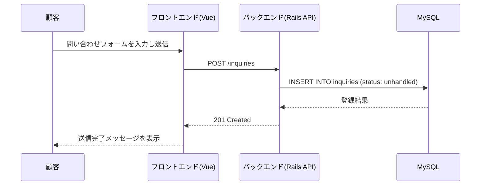
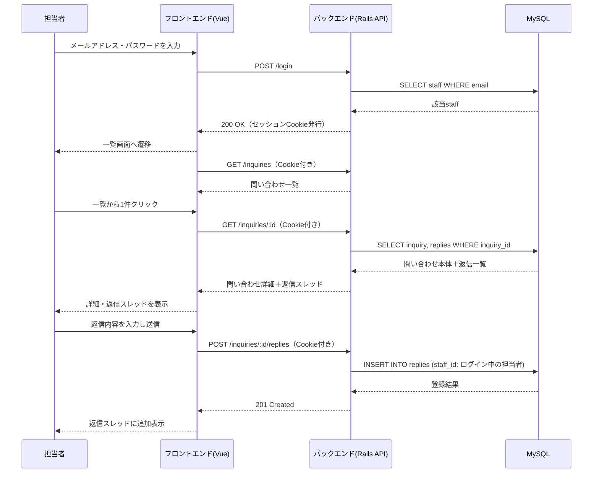

[« 画面仕様に戻る](screens.md)

# API仕様：InquiryManagement

## 認証方式

担当者ログインは、Railsのセッション（Cookie）ベースの認証とする。ログイン成功時にサーバー側でセッションを発行し、
以降のリクエストはCookieによって担当者を識別する。ログイン不要なエンドポイント（問い合わせ投稿）以外は、
未ログイン状態でアクセスした場合`401 Unauthorized`を返す。

## エンドポイント一覧

| メソッド | パス | 認証 | 説明 | 対応ユースケース |
|---|---|---|---|---|
| POST | /inquiries | 不要 | 問い合わせを新規登録する | UC1 |
| POST | /login | 不要 | メールアドレス・パスワードでログインする | UC2 |
| DELETE | /logout | 必要 | ログインセッションを終了する | UC7 |
| GET | /inquiries | 必要 | 問い合わせ一覧を取得する | UC3 |
| GET | /inquiries/:id | 必要 | 問い合わせ詳細と返信一覧を取得する | UC4 |
| POST | /inquiries/:id/replies | 必要 | 指定した問い合わせに返信を投稿する | UC5 |
| PATCH | /inquiries/:id | 必要 | 問い合わせのステータスを変更する | UC6 |

## 主要エンドポイントの入出力

### POST /inquiries（問い合わせ投稿）

- リクエスト: `name`（氏名）, `email`（メールアドレス）, `subject`（件名）, `body`（内容）
- レスポンス（成功時）: 登録された問い合わせ（`status`は自動的に`unhandled`）
- レスポンス（失敗時）: 未入力項目がある場合`422 Unprocessable Entity`とエラー内容

### POST /login（ログイン）

- リクエスト: `email`, `password`
- レスポンス（成功時）: ログインした担当者の情報（`id`, `name`, `email`）。Cookieにセッション情報が設定される
- レスポンス（失敗時）: 認証失敗時`401 Unauthorized`

### GET /inquiries（一覧取得）

- レスポンス: 問い合わせの配列（`id`, `subject`, `name`, `status`, `created_at`）

### GET /inquiries/:id（詳細取得）

- レスポンス: 問い合わせ本体（`name`, `email`, `subject`, `body`, `status`, `created_at`）と、
  紐づく返信の配列（`replies`。各要素は`body`, `staff`（返信した担当者名）, `created_at`を、投稿日時の古い順に含む）

### POST /inquiries/:id/replies（返信投稿）

- リクエスト: `body`（返信内容）
- レスポンス（成功時）: 登録された返信（投稿した担当者はログインセッションから特定する）
- レスポンス（失敗時）: 本文が未入力の場合`422 Unprocessable Entity`

### PATCH /inquiries/:id（ステータス変更）

- リクエスト: `status`（`unhandled` / `in_progress` / `completed`のいずれか）
- レスポンス: 更新後の問い合わせ

## シーケンス図

### 問い合わせ投稿（UC1）

### ログイン〜問い合わせ詳細確認・返信（UC2, UC3, UC4, UC5）

各エンドポイントに対応する画面は[画面仕様](screens.md)、データ構造は[データベース設計](database.md)を参照。
