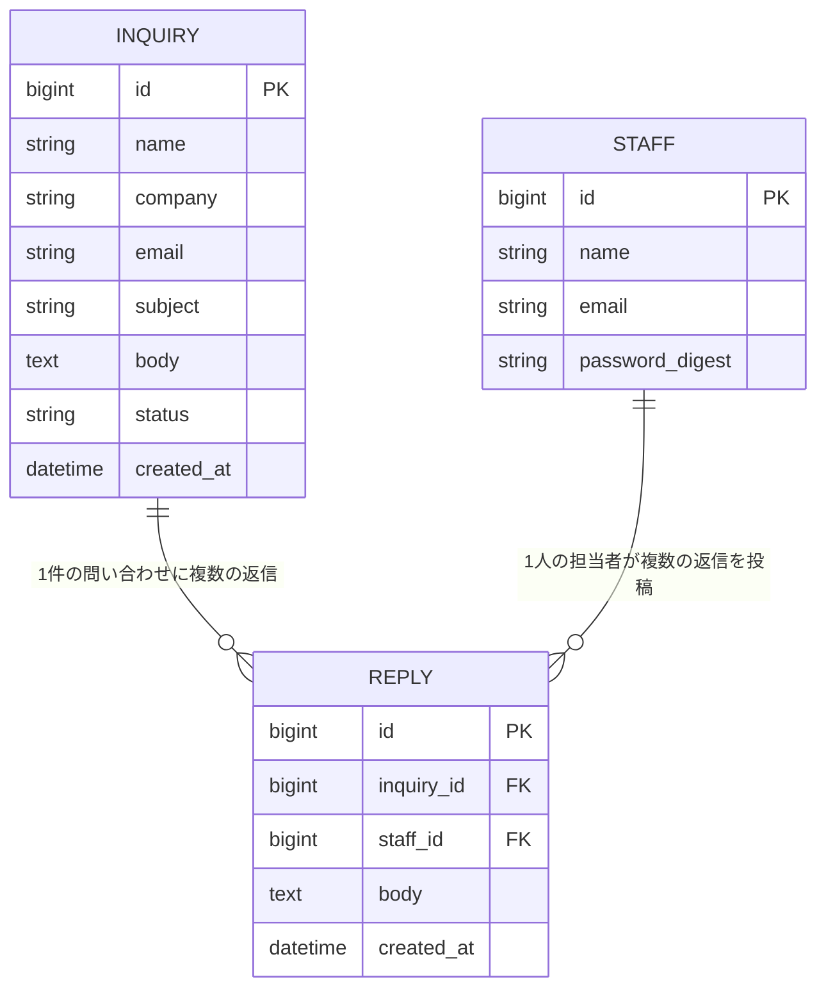

[« 画面仕様に戻る](screens.md)

# データベース設計：InquiryManagement

## データ項目

### Inquiry（問い合わせ）

| 項目名 | 型 | 説明 |
|---|---|---|
| id | 整数（bigint） | 問い合わせID（自動採番） |
| name | 文字列（string） | 送信者（顧客）の氏名。必須 |
| company | 文字列（string） | 送信者（顧客）の会社名。必須 |
| email | 文字列（string） | 送信者（顧客）のメールアドレス。必須 |
| subject | 文字列（string） | 件名。必須 |
| body | テキスト（text） | 問い合わせ内容。必須 |
| status | 文字列（string） | ステータス。Railsの enum で `unhandled`=未対応 / `in_progress`=対応中 / `completed`=対応済み に制限。DBデフォルトは `unhandled` |
| created_at | 日時 | 受信日時 |
| updated_at | 日時 | 更新日時 |

### Reply（返信）

| 項目名 | 型 | 説明 |
|---|---|---|
| id | 整数（bigint） | 返信ID（自動採番） |
| inquiry_id | 整数（bigint） | 紐づく問い合わせのID（外部キー、NOT NULL、インデックスあり） |
| staff_id | 整数（bigint） | 返信した担当者のID（外部キー、NOT NULL、インデックスあり） |
| body | テキスト（text） | 返信内容。必須 |
| created_at | 日時 | 投稿日時 |
| updated_at | 日時 | 更新日時 |

### Staff（担当者）

| 項目名 | 型 | 説明 |
|---|---|---|
| id | 整数（bigint） | 担当者ID（自動採番） |
| name | 文字列（string） | 担当者名。必須 |
| email | 文字列（string） | ログインに使うメールアドレス。必須・一意（ユニークインデックスあり） |
| password_digest | 文字列（string） | `has_secure_password`（bcrypt）によるパスワードのハッシュ値。平文のパスワードは保存しない |
| created_at | 日時 | 作成日時 |
| updated_at | 日時 | 更新日時 |

## ER図

1件のInquiryに対して複数件のReplyが紐づく（1対多）。1件のReplyは1人のStaffが投稿する（多対1）。

## 補足

- 全テーブルに Rails 標準の `created_at` / `updated_at`（`datetime`）を持つ
- テーブル名は Rails の規約どおり複数形（`inquiries` / `replies` / `staffs`）。文字コードは `utf8mb4`
- `replies` から `inquiries` / `staffs` へ外部キー制約を張っている。`Inquiry` 削除時は関連する `Reply` も削除される（`dependent: :destroy`）。ただし問い合わせ・担当者の削除機能自体はスコープ外
- 顧客（問い合わせの送信者）はアプリのユーザーとして登録しない。`Inquiry` の `name`・`email` は入力値をそのまま保存するのみで、`Staff` とは別概念とする
- 担当者の削除・編集機能は今回のスコープ外とする（初期データとして [`backend/db/seeds.rb`](../backend/db/seeds.rb) で3件の Staff を用意する）
- DBの物理構成（MySQL、永続化の方針など）は[要件定義書の非機能要件](requirements.md#非機能要件)と[技術スタック](tech-stack.md)を参照
