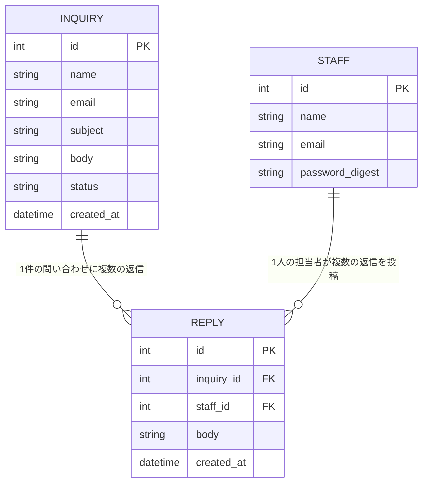

[« 画面仕様に戻る](screens.md)

# データベース設計：InquiryManagement

## データ項目

### Inquiry（問い合わせ）

| 項目名 | 型 | 説明 |
|---|---|---|
| id | 整数 | 問い合わせID（自動採番） |
| name | 文字列 | 送信者（顧客）の氏名 |
| email | 文字列 | 送信者（顧客）のメールアドレス |
| subject | 文字列 | 件名 |
| body | 文字列 | 問い合わせ内容 |
| status | Enum | ステータス（unhandled=未対応 / in_progress=対応中 / completed=対応済み）。作成時は常にunhandled |
| created_at | 日時 | 受信日時 |
| updated_at | 日時 | 更新日時 |

### Reply（返信）

| 項目名 | 型 | 説明 |
|---|---|---|
| id | 整数 | 返信ID（自動採番） |
| inquiry_id | 整数 | 紐づく問い合わせのID（外部キー） |
| staff_id | 整数 | 返信した担当者のID（外部キー） |
| body | 文字列 | 返信内容 |
| created_at | 日時 | 投稿日時 |

### Staff（担当者）

| 項目名 | 型 | 説明 |
|---|---|---|
| id | 整数 | 担当者ID（自動採番） |
| name | 文字列 | 担当者名 |
| email | 文字列 | ログインに使うメールアドレス（一意） |
| password_digest | 文字列 | パスワードのハッシュ値（平文のパスワードは保存しない） |

## ER図

1件のInquiryに対して複数件のReplyが紐づく（1対多）。1件のReplyは1人のStaffが投稿する（多対1）。

## 補足

- 顧客（問い合わせの送信者）はアプリのユーザーとして登録しない。InquiryのInquiryの`name`・`email`は入力値をそのまま保存するのみで、Staffとは別概念とする
- 担当者の削除・編集機能は今回のスコープ外とする（初期データとして数件のStaffを用意する想定）
- DBの物理構成（MySQL、永続化の方針など）は[要件定義書の非機能要件](requirements.md#非機能要件)と[技術スタック](tech-stack.md)を参照
