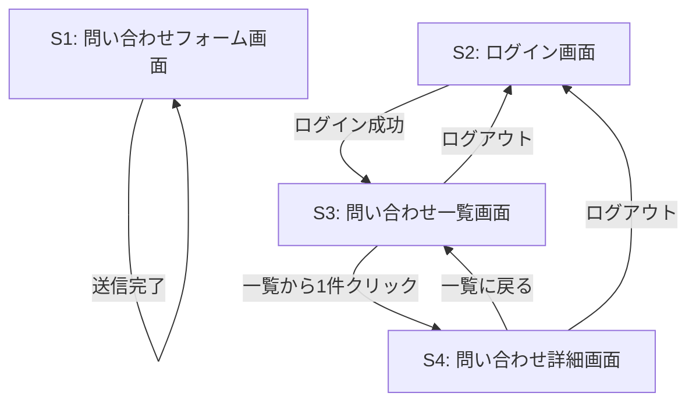

# 画面仕様：InquiryManagement（問い合わせ管理アプリ）

問い合わせ管理アプリの画面設計をまとめたドキュメント。本ドキュメントを起点として、[要件定義書](requirements.md)・[機能要件](features.md)・[データベース設計](database.md)・[API仕様](api.md)・[技術スタック](tech-stack.md)にリンクしている。

## 動作確認

<!-- TODO: 実際の動作確認動画をここに貼り付ける -->

準備中。実装完了後、一連の操作（問い合わせ投稿 → 担当者ログイン → 一覧・詳細確認 → 返信・ステータス変更）を確認できる動画をここに追加する予定。

## 画面一覧

| 画面ID | 画面名 | ログイン | 説明 |
|---|---|---|---|
| S1 | 問い合わせフォーム画面 | 不要 | 顧客が問い合わせを送信する画面 |
| S2 | ログイン画面 | 不要 | 担当者がメールアドレス・パスワードでログインする画面 |
| S3 | 問い合わせ一覧画面 | 必要 | 全問い合わせを一覧表示する画面 |
| S4 | 問い合わせ詳細画面 | 必要 | 問い合わせ本文・返信スレッド・返信フォーム・ステータス変更欄を表示する画面 |

## 画面遷移図



顧客はS1のみを利用し、ログインしない。担当者はS2でログイン後、S3・S4を行き来する（[機能要件](features.md)のユースケース参照）。

## ワイヤーフレーム

### S1: 問い合わせフォーム画面

```
+--------------------------------------------+
|  お問い合わせ                                |
+--------------------------------------------+
|  氏名       [_____________________]         |
|  メールアドレス [_________________]         |
|  件名       [_____________________]         |
|  内容                                        |
|  [                                    ]     |
|  [                                    ]     |
|                                              |
|                          [ 送信 ]            |
+--------------------------------------------+
```

### S2: ログイン画面

```
+--------------------------------------------+
|  担当者ログイン                              |
+--------------------------------------------+
|  メールアドレス [_________________]         |
|  パスワード     [_________________]         |
|                                              |
|                        [ ログイン ]          |
+--------------------------------------------+
```

### S3: 問い合わせ一覧画面

```
+--------------------------------------------+
|  問い合わせ一覧                    [ログアウト]|
+--------------------------------------------+
|  件名        | 送信者   | ステータス | 受信日時|
|--------------+----------+-----------+---------|
|  ○○の件      | 山田太郎 | 未対応     | 08/20   |
|  △△について  | 佐藤花子 | 対応中     | 08/22   |
|  ...                                          |
+--------------------------------------------+
```

### S4: 問い合わせ詳細画面

```
+--------------------------------------------+
|  問い合わせ詳細                    [ログアウト]|
+--------------------------------------------+
|  件名: ○○の件                               |
|  氏名: 山田太郎  メール: yamada@example.com  |
|  内容: ..........................            |
|                                              |
|  ステータス: [未対応 ▼]                      |
+--------------------------------------------+
|  返信スレッド                                |
|  [担当者A] ................. 08/21          |
|  [担当者B] ................. 08/22          |
+--------------------------------------------+
|  返信内容                                    |
|  [                                    ]     |
|                          [ 返信する ]        |
+--------------------------------------------+
```

## 関連ドキュメント

- [要件定義書](requirements.md)
- [機能要件](features.md)
- [データベース設計](database.md)
- [API仕様](api.md)
- [技術スタック](tech-stack.md)
