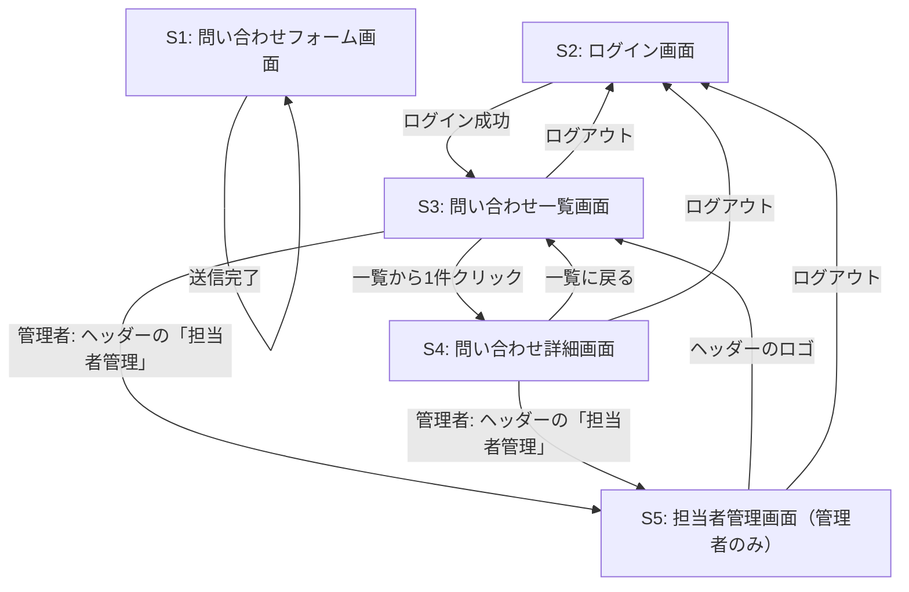

# 画面仕様：InquiryManagement（問い合わせ管理アプリ）

問い合わせ管理アプリの画面設計をまとめたドキュメント。本ドキュメントを起点として、[要件定義書](requirements.md)・[機能要件](features.md)・[データベース設計](database.md)・[API仕様](api.md)・[技術スタック](tech-stack.md)にリンクしている。

## 動作確認

<!-- TODO: 実際の動作確認動画をここに貼り付ける -->

S1〜S4 とも実装済み。一連の操作（問い合わせ投稿 → 担当者ログイン → 一覧・詳細確認 → 返信・ステータス変更）を確認できる動画は今後追加する。完成イメージの静的モックは [`../mock/index.html`](../mock/index.html)。

## 画面一覧

| 画面ID | 画面名 | ログイン | 説明 |
|---|---|---|---|
| S1 | 問い合わせフォーム画面 | 不要 | 顧客が問い合わせを送信する画面 |
| S2 | ログイン画面 | 不要 | 担当者がメールアドレス・パスワードでログインする画面 |
| S3 | 問い合わせ一覧画面 | 必要 | 全問い合わせを一覧表示する画面 |
| S4 | 問い合わせ詳細画面 | 必要 | 問い合わせ本文・返信スレッド・返信フォーム・ステータス変更欄を表示する画面 |
| S5 | 担当者管理画面 | 必要（管理者のみ） | 担当者の一覧と追加フォームを表示する画面 |

## 画面遷移図



顧客はS1のみを利用し、ログインしない。担当者はS2でログイン後、S3・S4を行き来する。管理者はさらにS5を利用できる（[機能要件](features.md)のユースケース参照）。

- 実装のルーティング: `/`（S1）/ `/login`（S2）/ `/inquiries`（S3）/ `/inquiries/:id`（S4）/ `/staffs`（S5）。未ログインで S3〜S5 に直接アクセスすると `/login` にリダイレクトする。一般担当者が S5 にアクセスすると `/inquiries` にリダイレクトする
- ヘッダーは全画面共通。ログイン中は担当者名と「ログアウト」、管理者にはさらに「担当者管理」リンクを表示する（下のワイヤーフレームでは各画面に `[ログアウト]` と記載しているが、実装では共通ヘッダーにまとめている）

## ワイヤーフレーム

### S1: 問い合わせフォーム画面

```
+--------------------------------------------+
|  お問い合わせ                                |
+--------------------------------------------+
|  会社名     [_____________________]         |
|  氏名       [_____________________]         |
|  メールアドレス [_________________]         |
|  件名       [_____________________]         |
|  内容                                        |
|  [                                    ]     |
|  [                                    ]     |
|                                              |
|                          [ 送信 ]            |
+--------------------------------------------+
```

すべての項目が必須。

### S2: ログイン画面

```
+--------------------------------------------+
|  担当者ログイン                              |
+--------------------------------------------+
|  メールアドレス [_________________]         |
|  パスワード     [_________________]         |
|                                              |
|                        [ ログイン ]          |
+--------------------------------------------+
```

### S3: 問い合わせ一覧画面

```
+--------------------------------------------+
|  問い合わせ一覧                    [ログアウト]|
+--------------------------------------------+
|  件名     | 会社名   | 送信者   | ステータス | 受信日時 |
|-----------+----------+----------+-----------+---------|
|  ○○の件   | ○○商事   | 山田太郎 | 未対応     | 08/20   |
|  △△について| △△工業  | 佐藤花子 | 対応中     | 08/22   |
|  ...                                                    |
+--------------------------------------------+
```

### S4: 問い合わせ詳細画面

```
+--------------------------------------------+
|  問い合わせ詳細                    [ログアウト]|
+--------------------------------------------+
|  件名: ○○の件                               |
|  会社名: ○○商事                              |
|  氏名: 山田太郎  メール: yamada@example.com  |
|  内容: ..........................            |
|                                              |
|  ステータス: [未対応 ▼]                      |
+--------------------------------------------+
|  返信スレッド                                |
|  [担当者A] ................. 08/21          |
|  [担当者B] ................. 08/22          |
+--------------------------------------------+
|  返信内容                                    |
|  [                                    ]     |
|                          [ 返信する ]        |
+--------------------------------------------+
```

### S5: 担当者管理画面（管理者のみ）

```
+--------------------------------------------+
|  担当者管理             山田太郎  [ログアウト]|
+--------------------------------------------+
|  担当者を追加                                |
|  氏名           [_____________________]      |
|  メールアドレス [_____________________]      |
|  パスワード     [_____________________]      |
|                          [ 追加する ]        |
+--------------------------------------------+
|  登録済みの担当者（3 名）                     |
|  山田 太郎   yamada@example.com   [管理者]   |
|  佐藤 花子   sato@example.com                |
|  鈴木 一郎   suzuki@example.com              |
+--------------------------------------------+
```

パスワードは8文字以上。追加される担当者は一般権限。

## 関連ドキュメント

- [要件定義書](requirements.md)
- [機能要件](features.md)
- [データベース設計](database.md)
- [API仕様](api.md)
- [技術スタック](tech-stack.md)
